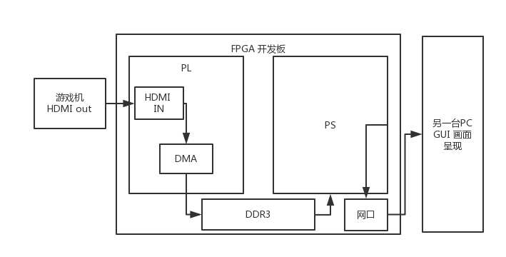

# C-UNIX2018-project

## Project 选题

自主选题: 通过网络传输的视频采集卡

题目来源: 如今游戏主播是一个很火热的发展的行业,为了能将各种游戏机终端的游戏画面通过网络进行直播,用户需要使用采集卡将主机的输出画面传输到用于直播的计算机中.我出于业余爱好,而且恰好有一块xilinx zynq 7010开发板,希望借此机会使用它制作一个视频采集卡.这块开发板中有一个ARM硬核,可以运行 LINUX 操作系统.整体工作内容如下图所示:

 使用FPGA实现HDMI的接口和DMA, 将视频数据直接缓存与内存中,PS部分通过网络使用套接字(socket)将图像发送给显示终端.显示终端包括将画面呈现和一系列的交互功能,如调整分辨率,添加滤镜,数据录制等功能. 该终端程序通过多进程实现,包括:数据解析进程,录制进程,图像处理进程.

初步安排: 18日前完成FPGA部分的设计,和开发板linux操作系统固件制作,并基本确定显示终端GUI 和其执行框架.

## 设计思路

整个思路分为图像采集和发送部分，以及接收和服务两部分。

### 图像采集与发送

图像通过硬件采集之后，由 DMA 直接存储在内存中，存储结果为8位整形数据，数据为三通道，即一个像素为24 bit。数据采集部分不需要CPU的参与，有DMA直接完成，可以看作一个单独的进程，该进程将采到数据不断的存储在内存中，且没有上锁。数据发送分为三个进程，即将数据拆分成三份后进行发送。

### 图像接收和 web 后端服务

接收端PC，同样通过三个线程进行数据的接收。它的父进程就可以将接收的到数据进行缓存。另一个进程用于对图像做信号处理，如各种滤镜和图片分辨率的变化。另一个进程则主要负责web端的服务，将图像展示与网页中

## 实际实现

考虑到时间有限，最后图像采集部分，没有在ｆｐｇａ上实现，而是采用计算机上模拟的方式．图像接受的客户端也没有采用ｗｅｂ客户端，而是采用了QT.

## 测试方法
首先进入 image_socket 文件夹中，根据介绍，打开图像发送服务器．之后进入 web-gui 文件夹中，打开图像接收客户端，按照介绍执行，就可以完成测试
